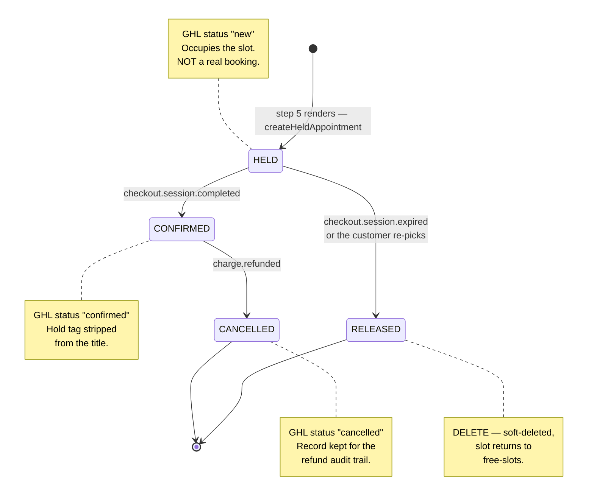
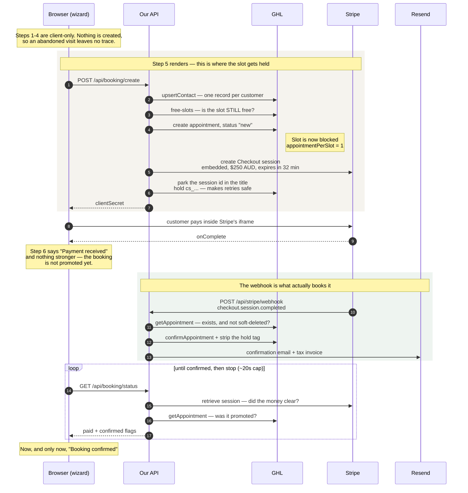

# FB-01 — Booking + payment flow (Option B)

**Status:** built and verified in test mode, confirmation email included. Written and
implemented 2026-08-10; **reconciled against the code 2026-08-13** — see
[What is NOT built](#what-is-not-built) before trusting any behaviour described below.
**Decision:** Stripe **Checkout**, **embedded** mode (`ui_mode: "embedded_page"` — the
value `"embedded"` is rejected), confirmed by the user 2026-08-10 — plus booking **Option B**: hold the slot, pay, confirm on webhook.

Embedded was chosen over hosted because the redirect would discard every field the
customer entered in steps 1–4, forcing server-side payload persistence and a
server-rendered step 6. Embedded keeps the wizard's React state intact. The cost is a
domain-registration step before Apple Pay works.

Supersedes the 2026-08-05 choice of Stripe Elements. Elements was chosen because hosted
Checkout redirects away from the six-step wizard; embedded Checkout does not, so the
original objection no longer applies.

Related: `docs/forms-backend-requirements.csv` (FB-01), **CA-36** in
`docs/content-accuracy-changes.csv`, open item 1 in `CLAUDE.md`.

---

## What is NOT built

Added 2026-08-13 after checking every claim in this document against the working tree.
This file grew an as-built narrative on top of its original plan, and the two halves had
drifted. **Four behaviours described below were never implemented, and one is implemented
but cannot fire.** Each is marked in place; this is the index.

| Described | Reality | Consequence |
|---|---|---|
| `POST /api/booking/release` — cancel the hold when the customer goes Back | **Never built.** `app/api/booking/` contains only `create`, `slots`, `status` | Changing slot at step 5 leaves the old hold until the session expires (32 min) |
| Sweep of HELD appointments older than 35 minutes, on each free-slots read | **Never built.** `slots/route.ts` is a 37-line cached read. The only `sweep` matches in the tree are comments explaining why a *status-driven* sweep would be dangerous | No early reclaim. `checkout.session.expired` is the only thing that releases an abandoned hold |
| Alert ops by email when paid-but-GHL-confirm-fails | **Never built.** `console.error` only (`webhook:57-63`) | The money-is-real-and-the-booking-is-broken case is a log line nobody watches |
| Write amount / Stripe payment id / invoice URL back to the GHL contact | **Never built.** Zero GHL writes in the webhook beyond `confirmAppointment` | Those values live only on the Stripe session and in the customer's email |
| `charge.refunded` → CANCELLED | **Built but dead.** `createBookingSession` sets no `payment_intent_data.metadata`, so session metadata never reaches the Charge and `metadata.appointmentId` is always undefined — **FA-32** | A refunded booking stays `confirmed`; an installer is dispatched to a refunded customer |

Together the first two mean an indecisive customer can hold more than one slot at once:
`BookingCheckout` mounts per visit to step 5 with a per-instance `started` ref, and
`/api/booking/create` only consults `findHeldAppointment` when the slot is *not* free — so
a Back-then-different-slot takes a second hold and nothing reclaims the first early.
**Expected from reading the code, not yet observed at runtime** — worth confirming in the
browser against the live calendar before it drives any priority decision.

---

## GHL write path — verified 2026-08-10

Tested against the live "Installation Booking" calendar (`npZXAznB0NJZ4g4eclvU`) with a
throwaway contact, then fully cleaned up (0 events remaining, slot restored, contact
deleted). **Option B is viable — every transition it needs works.**

| Test | Result |
|---|---|
| `POST /contacts/` | 201 — token has `contacts.write` |
| `POST /calendars/events/appointments` with `appointmentStatus: "new"` | 201, and the status **stuck as `new` despite the calendar's `autoConfirm: true`** — this is what makes a HELD state possible |
| Does a `new` appointment block the slot? | **Yes.** 13:30 disappeared from `free-slots` (5 slots → 4) |
| `PUT …/appointments/{id}` → `confirmed` | 200 |
| `PUT …/appointments/{id}` → `cancelled` | 200, slot returned to `free-slots` (4 → 5) |
| `DELETE /calendars/events/{id}` | 200 `{succeeded:true}` — event gone entirely |
| `DELETE /contacts/{id}` | 200 |

Relevant calendar config: `slotDuration` 90 min, `slotInterval` 90, **`appointmentPerSlot: 1`**
(so one hold genuinely reserves the slot), `allowBookingFor` 28 days — matching
`BOOKING_WINDOW_DAYS` — `round_robin` with a single team member
(`mSEzT8p1mQkob7KuFuJv`), and **`notifications: []`**, so no mail fires on create. Pass
`toNotify: false` regardless.

**Two release mechanisms, and they are not interchangeable:**

- **`DELETE`** for abandoned holds — leaves no trace, keeps the calendar clean.
- **`appointmentStatus: "cancelled"`** for a real post-payment cancellation — frees the
  slot but keeps the record, which matters because the terms promise refunds and you want
  the audit trail.

> ⚠️ **`new` is not a private status.** There is no dedicated "held" state — `new` is also
> what GHL assigns to any booking made by hand in its own UI. **The expiry sweep must
> therefore never delete on status alone**, or it will silently destroy staff-created
> bookings 35 minutes after they're entered.

**The sweep therefore runs Stripe → GHL, not GHL → Stripe.** We read expired Checkout
sessions from Stripe and delete the appointment each one names in
`metadata.appointmentId`. Every delete we ever issue is driven by an id Stripe handed us,
so an appointment we did not create is structurally unreachable — no tagging scheme, no
title parsing, and nothing ugly in the installers' calendar. `releaseHold()` documents
this as a hard precondition.

Also probed 2026-08-10: `title` and `address` persist on an appointment (installers read
the address off the calendar), but **`notes` is accepted and silently dropped** — don't
put anything load-bearing there. `createdBy.source` comes back as `"third_party"` for
API-created appointments, a useful discriminator if a GHL-side audit is ever needed.

### GHL soft-deletes — check `deleted`, not just "did it resolve"

Found while testing the expiry path on 2026-08-10. `releaseHold()` does remove the
appointment and the slot returns to `free-slots` immediately — but a deleted appointment
**still answers `GET` with HTTP 200**, carrying its original `appointmentStatus` plus
`deleted: true`. There is no 404.

So any code that treats "the request resolved" as "the booking exists" is wrong. Two
places would have been: the webhook's *paid but the hold is gone* branch would never have
fired (it would have confirmed a deleted appointment and alerted nobody), and
`/api/booking/status` would have told a customer they were confirmed while the slot was
back on sale. `Appointment.deleted` now carries the flag and both check it, as does
`findHeldAppointment`.

### Why the session id is parked on the appointment title

Discovered while building step 2, and it constrains anything that touches session
creation. **Stripe idempotency keys cannot make `/api/booking/create` safe to retry.**
`expires_at` is derived from the current time, so a retry sends different parameters
under the same key and Stripe rejects it outright — *"keys for idempotent requests can
only be used with the same parameters they were first used with"*. Anchoring `expires_at`
to when the hold was taken does not rescue it either: Stripe requires at least 30 minutes
from *now*, so an anchored value falls under the floor about two minutes after the hold
is created.

So the session id has to be recoverable from our own data. It goes in the appointment
**title** — the only writable field that persists (`notes` is silently dropped) — as
`Name — FineVu installation [hold cs_…]`. `confirmAppointment()` strips the tag as it
promotes the booking, so the ugly form is visible for at most the length of a hold.
Without this, every retry would mint a second payable session against one held slot.

### Implementation status

**Step 1 of 5 complete** — `lib/ghl.ts` write path, 2026-08-10. Adds `upsertContact`,
`isSlotFree`, `createHeldAppointment`, `getAppointment`, `confirmAppointment`,
`cancelAppointment`, `releaseHold`, over a shared `ghlFetch` helper that throws with the
response body on any non-2xx. Verified end-to-end through a temporary route against the
live calendar (create → hold blocks slot → confirm → cancel → release → idempotent
re-release), then cleaned up to zero events. Two API quirks handled: contacts need
`Version: 2021-07-28` where calendars need `2021-04-15`, and GHL's create response omits
`startTime`/`endTime` that its GET returns, so the created object is backfilled.

**Step 2 of 5 complete** — `lib/stripe.ts` + `POST /api/booking/create`, 2026-08-10.
Verified end-to-end against test-mode Stripe and the live calendar: a first call holds
the slot and returns a client secret; two retries return the **same** appointment and the
**same** session (`reused: true`); a different customer on the same slot gets `409
slot_taken`; an NT postcode gets `422`; a missing field gets `400`; and a sixth request
from one IP inside ten minutes gets `429`. The session reads back as `payment` /
`embedded_page` / `25000 AUD` / `+32 min` / `redirect_on_completion: never` /
`invoice_creation: true`, with the full booking payload in metadata. Calendar returned to
zero events and all test contacts deleted afterwards.

**Steps 3 and 4 of 5 complete** — 2026-08-10. Step 5 of the wizard now mounts Stripe's
embedded Checkout (`components/booking/BookingCheckout.tsx`) in place of the deleted card
fields; `POST /api/stripe/webhook` promotes the hold on `checkout.session.completed`,
releases it on `.expired`, and cancels on `charge.refunded`; `GET /api/booking/status`
reports the real state and reconciles straight from Stripe when the webhook is late.

Verified against a real test-mode booking: session `complete`/`paid` → status reported
`paid: true, confirmed: false` → webhook replayed → appointment promoted `new` →
`confirmed`, hold tag stripped from the title, status flipped to `confirmed: true`.
Replaying the same event again changed nothing (idempotent, 200). Expiring a session
released its hold and returned the slot to availability. Unsigned and mis-signed payloads
are both rejected 400.

**Step 5 of 5 built** — `lib/email/bookingConfirmation.ts` + `lib/data/business.ts`,
2026-08-10. The webhook sends the confirmation only after the appointment is actually
promoted, so the email can never claim a booking that did not happen. A send failure is
logged, never thrown: a Resend outage must not 500 the webhook and make Stripe replay the
delivery.

The email is **both** the confirmation and the tax invoice, deliberately. A default
Stripe receipt carries no ABN and no GST line, so it is not a valid Australian tax
invoice, and `/installation:84` promises the customer one. Stripe's own
`invoice_creation` invoice is linked as a convenience when it exists, but the compliant
document is ours.

⚠️ **It ships with a PLACEHOLDER ABN (`00 000 000 000`) and cannot go live like that.**
Set `BUSINESS_ABN`, and set the same value on the Stripe account. `sendBookingConfirmation`
logs a warning on every send while the placeholder is in place. `BUSINESS_GST_REGISTERED`
drives whether the GST line appears at all — registration is separate from holding an ABN,
and showing GST when not registered would be worse than omitting it. Also unverified:
`legalName` is assumed to be "AutoXtreme Pty Ltd" and needs checking against the ABR.

~~The other launch blocker is unchanged: **Resend domain verification** (FB-08).~~
**Cleared 2026-08-13** — `finevuaustralia.com.au` is verified in Resend, so the sandbox
restriction is gone and mail can be sent to any address. FB-08 did not close, though; it
inverted. The domain can **send** but has **no MX record**, so it cannot **receive**, and
nobody has access to the `CONTACT_TO_EMAIL` mailbox. Sending was the half that got solved.

Two Stripe API details worth knowing: **`ui_mode: "embedded"` is rejected — the value is
now `embedded_page`** (same in-page iframe, renamed), and `expires_at` computed as exactly
+30 minutes sits on the rejection boundary, so `HOLD_TTL_MINUTES` is 32 to carry margin.

---

## Booking states

A **HELD** appointment occupies the slot but is not a real booking. Only the Stripe
webhook promotes it to **CONFIRMED**. Note the two different exits: an unpaid hold is
**deleted** so it leaves no trace, while a paid booking is **cancelled** so the record
survives — the terms promise refunds, and a refund needs something to point at.

> ⚠️ **The `CONFIRMED → CANCELLED` edge does not currently work.** The handler is written,
> but it reads `appointmentId` from `Stripe.Charge.metadata`, and `createBookingSession`
> sets metadata only at the Checkout Session level — which does not propagate to the
> PaymentIntent or the Charge. So `charge.refunded` always no-ops and a refunded booking
> stays `confirmed` on the calendar. Fix is either `payment_intent_data.metadata` on the
> session, or resolving the session via `charge.payment_intent`. Tracked as **FA-32**.

---

## Happy path

The two shaded bands are the parts that matter. The first is why a customer's slot cannot
be taken while they are typing their card details. The second is why the browser is never
trusted to declare a booking — `onComplete` fires in a tab that can be closed, so it earns
only "Payment received", and the webhook is what earns "Booking confirmed".

### Steps 1–4 — unchanged

Client-side only, exactly as today. No server calls, no records created. A visitor who
abandons at step 3 leaves no trace.

### Step 5 (a) — on entering the step, create the hold

The client POSTs the whole booking payload to **`POST /api/booking/create`**. This fires
when step 5 *renders*, not when a pay button is clicked — embedded Checkout needs a
session client secret before it can mount.

Server-side, in order:

1. **Re-validate the payload.** Never trust the client: required fields present, postcode
   serviceable (NT rejected `422`), `$250` never read from the request.
2. **Upsert the GHL contact** — name, phone, email, vehicle, address. Deliberately BEFORE
   the slot check, so a blocked slot can be attributed: our own hold blocks it too, and a
   retry must reuse that rather than be told someone else took it.
3. **Re-check the slot is still free** against GHL, uncached — this is the check that
   catches a slot taken between step 3 and step 5. On failure, `409` and the client bounces
   the customer back to step 3.
4. **Create the GHL appointment as HELD** at the chosen slot, linked to that contact.
5. **Create the Stripe Checkout Session:**
   - `mode: "payment"`, **`ui_mode: "embedded_page"`** — `"embedded"` is rejected
   - line item **$250 AUD as a server-side constant** (`25000` minor units)
   - full booking payload in `metadata`, keyed by `appointmentId` — the join key
   - `invoice_creation: { enabled: true }` for the tax invoice
   - **`expires_at`: +32 minutes** (`HOLD_TTL_MINUTES`) — exactly +30 sits on Stripe's
     rejection boundary
   - `redirect_on_completion: "never"` — the wizard renders its own step 6
6. **Park the session id on the appointment title**, then return
   `{ clientSecret, sessionId, appointmentId, expiresAt }`.

> **Idempotency — the original plan here was wrong and is not what shipped.** It proposed a
> client-generated stable request id. Stripe idempotency keys cannot work for this route at
> all (see [Why the session id is parked on the appointment
> title](#why-the-session-id-is-parked-on-the-appointment-title)), and no `requestId`
> exists in the code. Retry safety comes from parking the session id in the appointment
> title and recovering it via `findHeldAppointment` + `sessionIdFromTitle`.

### Step 5 (b) — pay

`<EmbeddedCheckout>` mounts where the four card inputs are today. Stripe supplies its own
pay button, so the wizard's footer "Pay $250 AUD" button is hidden on step 5. 3DS is
handled inline by Stripe.

### Step 6 — two independent things happen

**a. The browser** gets Checkout's completion callback and advances to step 6, which calls
**`GET /api/booking/status?session_id=…`** to render real data.

**b. Stripe** fires `checkout.session.completed` to **`POST /api/stripe/webhook`**:

1. Verify the signature against `STRIPE_WEBHOOK_SECRET`.
2. Drop the event if this session id was already processed (Stripe retries; handlers must
   be idempotent).
3. Read `metadata.appointmentId` → flip the GHL appointment **HELD → CONFIRMED**.
   ⚠️ The planned write-back of amount / Stripe payment id / invoice URL onto the contact
   was **never built** — the webhook makes no GHL write beyond `confirmAppointment`. Those
   values exist only on the Stripe session and in the customer's email.
4. Send the confirmation + tax invoice via Resend.

**The webhook is the source of truth, not the browser.** Step 6 must render "confirmed"
only from server state. If the status endpoint hasn't seen confirmation yet, it polls for
a few seconds and then falls back to *"payment received — we're confirming your booking
and your email is on its way"* rather than asserting something unverified.

`GET /api/booking/status` also retrieves the session from Stripe directly, so a customer
who refreshes gets the truth even if the webhook is running late.

---

## Failure paths

✅ = verified in the code 2026-08-13. ❌ = described here but **not implemented**.

| What happens | Handling | |
|---|---|---|
| Customer abandons at step 5 | Session expires at **32 min** → `checkout.session.expired` → `releaseHold` deletes the appointment, slot returns to availability | ✅ |
| Payment declined | Customer retries inside Checkout; the hold stands until the session expires | ✅ |
| Slot taken between step 3 and step 5 | Caught by the uncached re-check in `create`; `409` and the customer returns to step 3 with a message | ✅ |
| Webhook never arrives | Stripe retries for up to 3 days, and `/api/booking/status` reconciles on demand by reading the session from Stripe | ✅ |
| Customer clicks Back to change the slot | ~~`POST /api/booking/release` cancels the hold~~ — **that route was never built.** The old hold survives until its session expires, and re-entering step 5 on a different slot takes a **second** hold | ❌ |
| Orphaned holds generally | ~~A sweep on each free-slots read cancels HELD appointments older than 35 minutes~~ — **never built.** `checkout.session.expired` is the only reclaim path, so an orphan whose webhook is lost persists until someone clears it by hand | ❌ |
| **Paid, but GHL confirm fails** | Money captured, appointment stuck HELD. Handled as far as *detection* — the webhook logs `PAID BUT THE HOLD IS GONE` and does not auto-refund. ~~Alert ops by email~~ was **never built**, so nothing surfaces this outside the Vercel logs | ⚠️ |
| **Refund issued** | ~~`charge.refunded` → CANCELLED~~ — the handler exists but **can never fire** (FA-32): session metadata does not propagate to the Charge, so `appointmentId` is always undefined and the booking stays `confirmed` | ❌ |

---

## Where the data lives

There is **no database**, and this design does not add one:

- **Stripe** holds the payment and the booking payload in session metadata.
- **GHL** holds the contact and the appointment — the durable customer record.
- **Booking reference** = the GHL appointment id (or a short hash of the Stripe session
  id), replacing today's `"FV-" + Math.random()`.

This keeps the site's no-database architecture and puts the registration, warranty claim
and booking on one GHL contact, which was the reason GHL was chosen.

---

## Code changes

**New**

- ✅ `app/api/booking/create/route.ts` — validate, re-check slot, hold, create session
- ✅ `app/api/booking/status/route.ts` — read-through status for step 6
- ✅ `app/api/booking/slots/route.ts` — cached availability read (not in the original plan)
- ✅ `app/api/stripe/webhook/route.ts` — `completed` + `.expired` + `charge.refunded`
- ✅ `lib/stripe.ts` — server client, the $250 constant, session builder
- ✅ `lib/email/bookingConfirmation.ts`, `lib/data/business.ts` — confirmation + tax invoice
- ❌ `app/api/booking/release/route.ts` — **never built**

**Modified**

- `lib/ghl.ts` (74 lines, currently read-only) — add contact upsert, appointment create,
  status update, cancel, and the stale-hold sweep
- `app/installation/page.tsx`:
  - delete `ccName` / `ccNum` / `ccExp` / `ccCvc` from `Form` (`:94`) and `EMPTY` (`:96`)
  - delete the step-5 validate branch (`:229-237`)
  - replace the four card inputs (`:463-467`) with `<EmbeddedCheckout>`
  - `confirmRows()` (`:276`) — read `last4` from the session, not `form.ccNum`
  - `next()` (`:241-256`) — delete the 900 ms fake and the client-side ref
  - hide the footer pay button on step 5
- `docs/forms-backend-requirements.csv` — FB-01 status
- `.env.example` — the three Stripe keys

**Deleted:** nothing in `lib/submitForm.ts` — it stays for the other forms, but the unused
import at `app/installation/page.tsx:7` finally goes.

---

## Blockers — none of these are code

1. ~~**GHL write path is unverified.**~~ **Cleared 2026-08-10** — see the verification
   table above. Create-as-`new`, promote to `confirmed`, cancel and delete all work, and a
   held appointment does block the slot. Option B stands.
2. ~~**GHL API v2 access**~~ — confirmed on the plan (already noted in `lib/ghl.ts:5`).
3. **ABN** for the tax invoice. `app/installation/page.tsx:84` promises a tax receipt and
   `installation-terms.ts` says prices include GST; a Stripe receipt without an ABN is not
   an Australian tax invoice.
4. **Stripe account** — AU entity, business verification, **live** keys. ~~The three keys in
   `.env.local` are present but empty.~~ Test-mode keys are populated as of 2026-08-13
   (`sk_test_` / `pk_test_` / `whsec_`), so local and staging work end to end. Live keys and
   a production webhook endpoint with its own `whsec_` are still outstanding.
5. ~~**Resend domain verification** (FB-08)~~ — **done 2026-08-13.** Replaced by a different
   FB-08: `finevuaustralia.com.au` can now send, but has **no MX record**, so it cannot
   receive, and no one has access to the destination mailbox. That does not block the
   booking confirmation (which goes to the customer), but it does mean every *other* form's
   submissions go nowhere. Needs MX records via BrandShelter plus a provisioned mailbox.

## Open questions

- **Surcharge or absorb?** `installation-terms.ts` §"Payment surcharges" anticipates one.
  Every page currently promises a flat $250 — recommend absorbing the ~$4.55.
- **Refunds** — the terms promise them in four scenarios. Recommend manual via the Stripe
  dashboard for launch, not a built flow.

---

## Testing

### Automated — `npm run test:booking`

`scripts/e2e-booking.mjs`, plain `node`, no test framework and no new dependencies. Needs
the dev server running. **Refuses to start unless `STRIPE_SECRET_KEY` is a `sk_test_`
key**, since it creates and expires real sessions.

It writes to the live GHL calendar because there is nothing else to write to — the site
has no database. It snapshots the calendar first, deletes everything it created in a
`finally` block even on failure, and reports any residue against that snapshot, so real
bookings sitting on the calendar are left alone and never counted as litter.

34 checks: availability, hold creation and slot occupancy, retry reuse (same appointment
*and* session), slot contention, NT exclusion, field validation, rate limiting, status
before payment, signature rejection (unsigned and mis-signed), completion → promotion +
tag stripping, event replay, the soft-delete guard, and expiry → hold release.

**How the webhook is tested without a browser:** a Checkout Session cannot be paid through
the API, so card entry genuinely needs one. But the webhook payload is just signed JSON,
so the script builds the event and signs it exactly as Stripe does —
`t=<unix>,v1=HMAC_SHA256(secret, "<unix>.<body>")` via `node:crypto`. That exercises real
signature verification, the real handler, real GHL promotion and the real email send.

**What it deliberately cannot cover:** `/api/booking/status` retrieves the *real* session
from Stripe, so after a synthetic event it still reports `paid: false` — the session was
never actually paid. The script asserts that truthfully rather than faking it, and says so
in its output.

Two traps this suite hit while being written, both worth remembering:

- **`/api/booking/slots` caches for 30 seconds**, so it still advertises a slot that was
  just taken. Assertions about availability must query GHL's `free-slots` directly.
- **GHL's contact upsert matches on phone as well as email.** Two "different" test
  customers sharing a phone number merge into one contact, which silently turns the
  slot-contention test into a reuse test that always passes.

### Manual — the parts only a browser can do

Requires `stripe listen --forward-to localhost:3000/api/stripe/webhook`.

| Case | Card | Expected |
|---|---|---|
| Happy path | `4242 4242 4242 4242` | Step 6 shows "Payment received", upgrades to "Booking confirmed" in a few seconds; GHL flips to `confirmed`, tag stripped |
| 3D Secure | `4000 0027 6000 3184` | Authentication completes **inside** the iframe with no navigation away — the entire reason embedded was chosen over hosted |
| Declined | `4000 0000 0000 0002` | Hold survives, customer retries in place |
| Abandon at step 5 | — | Expire the session in the Stripe dashboard → slot returns to availability |
| Back from step 5, then forward | — | Same hold reused, no duplicate appointment |
| Mobile viewport | — | The Stripe iframe is a third-party embed inside a `max-w` card |

Then open the redirected email and check the tax-invoice block: ABN line, GST $22.73 of
$250, the appointment reference — and that the reference is **not** uppercased, since it
is a case-sensitive GHL id.

### Reading the confirmation email before the domain is verified

Set `BOOKING_EMAIL_REDIRECT_TO` in `.env.local`. Every booking confirmation then goes to
that address instead of the customer, with the real recipient in the subject
(`[TEST → sam@example.com] …`) and a banner in the body.

⚠️ **The sandbox caveat that used to live here is obsolete** — the domain was verified on
2026-08-13, so a redirect can now point at any address rather than only the Resend account
owner's. **That makes leaving it set more dangerous, not less.** It previously failed loudly
against any other address; it will now silently deliver every customer's confirmation and
tax invoice to one inbox. Keep it set locally as a safety net against test bookings emailing
a real person, and confirm it is unset in Vercel.

---

## Go-live checklist

- [ ] Unset `BOOKING_EMAIL_REDIRECT_TO` — leaving it set diverts every customer's
      confirmation and tax invoice to one inbox
- [ ] Set `BUSINESS_ABN`; confirm `legalName` against the ABR (currently the assumed
      "AutoXtreme Pty Ltd"); confirm `BUSINESS_GST_REGISTERED`
- [ ] Set the same ABN on the Stripe account so its invoice matches ours
- [x] ~~Verify `finevuaustralia.com.au` in Resend~~ — done 2026-08-13
- [ ] Move `CONTACT_FROM_EMAIL` off `onboarding@resend.dev` in Vercel — still unset there,
      so production is sending from the fallback despite the domain being verified
- [ ] **Fix FA-32 before taking a live payment** — a refund currently leaves the booking
      `confirmed` and an installer will be dispatched to a refunded customer
- [ ] Live Stripe keys, and create the production webhook endpoint with **its own**
      `whsec_` (a test-mode secret rejects live events)
- [ ] Decide surcharge vs absorb (recommend absorb — every page promises a flat $250)
- [ ] `npm run test:booking` against staging
- [ ] One real card payment end to end, then refund it

### ⚠️ Never delete a test contact that had an appointment

GHL only ever **soft-deletes** an appointment — it stays queryable with `deleted: true`.
Delete the contact it points at and the appointment becomes **orphaned**: GHL's
Appointments list shows it with status **"Invalid"**, and from that point it can be
removed neither through the UI nor through the API, which answers
`400 — "The event id is invalid or it has already been deleted."`

The result is a permanent ghost row on a production calendar. It is cosmetic — the
appointment is gone as far as `free-slots` and the events API are concerned, so it blocks
no availability and no customer is affected — but it cannot be cleared.

`scripts/e2e-booking.mjs` therefore deletes appointments and **leaves test contacts in
place**, printing them instead. Delete a contact by hand only if no appointment ever
referenced it.

Related gotcha found the same day: **GHL caps a `free-slots` date range at 31 days.** A
wider window returns `400` rather than a partial result, and code that reads the response
for date-shaped keys sees an error body as "no availability". `BOOKING_WINDOW_DAYS` is 28,
safely inside; do not raise it past 31.
